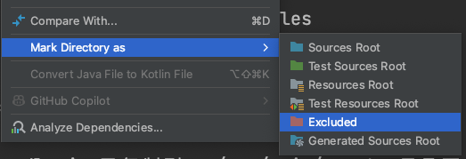

# Android JS-Bridge SDK

- [1.Overview](#section-1)
- [2.Quick Start](#section-2)
  - [2.1.Android Side](#section-2-1)
  - [2.2.JavaScript Side](#section-2-2)
    - [2.2.1.Setup JavaScript Project](#section-2-2-1)
    - [2.2.2.Business Service Configuration](#section-2-2-2)
    - [2.2.3.Building and Packaging](#section-2-2-3)
  - [2.3.Call the customScript function](#section-2-3)
- [3.SDK Update](#section-3)
  - [3.1.Android](#section-3-1)
  - [3.2.JavaScript](#section-3-2)
  - [3.3.Publishing](#section-3-3)
- [4.Sample App](#section-4)
- [5.FAQs](#section-5)

<h1 id="section-1">1.Overview</h1>

The Android JS-Bridge SDK enables seamless communication between Android native code and JavaScript running in a WebView. This SDK is perfect for building hybrid applications that leverage both native Android capabilities and web technologies.

<b>Requirements</b>
 - Android API level 26 (Android 8.0) or higher
 - Java 17+
 - Gradle 8.0+
 - Node.js 18+
 - NPM 9+

<h1 id="section-2">2.Quick start</h1>

<h2 id="section-2-1">2.1.Android Side</h2>

Add the JitPack Maven repository to your project-level `build.gradle` file:

```gradle
dependencyResolutionManagement {
	repositoriesMode.set(RepositoriesMode.FAIL_ON_PROJECT_REPOS)
	repositories {
		mavenCentral()
		maven { url 'https://jitpack.io' }    // Add this line
	}
}
```

Add the dependency to your `app/build.gradle` file:   

[](https://jitpack.io/#debeem/js-bridge)

```gradle
dependencies {
    implementation 'com.github.debeem:js-bridge:1.0.0-beta.1'
}
```

<h2 id="section-2-2">2.2.JavaScript Side</h2>

<h3 id="section-2-2-1">2.2.1.Setup JavaScript Project</h3>

Six steps are required to implement JS business logic calls:

 - ✅ Step 1: Copy builder scripts.
 - ✅ Step 2: JS Initialization.
 - ✅ Step 3: JS Business Service Configuration.
 - ✅ Step 4: JS Building and Packaging.
 - ✅ Step 5: Android Business Implementation and Custom Script Invocation.
 - ✅ Step 6: Android Compile and Debug 

✅ Step 1: Copy the script directory `builder` from the JS-Bridge SDK directory to the Android project.

✅ Step 2: Execute the initialization script `setup_webpack.sh`:

```shell
./builder/setup_webpack.sh
```
The generated `js` and `src/main/assets` directory structure:
```
js/
├── dist/
├── node_modules/
├── src/
│   ├── business.js
│   └── index.js
├── .gitignore
├── package.json
└── webpack.config.js

src/main/assets/
└── index.html
```
`js`：
 - `dist/`: The generated `bundle.js` file is stored.
 - `node_modules/`: Dependency package files.
 - `src/`: `index.js` and `business.js` business logic code.
 - `package.json`: configuration file.
 - `webpack.config.js`: webpack configuration file.

`src/main/assets/`：
 - `index.html`: The JS-Bridge SDK loads `index.html` (which includes the `bundle.js` services).

<h4 id="section-2-2-2">2.2.2.Business Service Configuration</h4>

✅ Step 3: Modify the business dependencies in the `builder/build_webpack.sh` file.

The script file contains a `debeem-wallet` example:

```shell
########################## Editable ###############################
# TODO: Modify to define the list of production dependency packages for your specific business logic.
prod_packages=("debeem-wallet" "debeem-id" "debeem-cipher" "ethers" "idb" "fake-indexeddb")
###################################################################

```

Then you need to modify the `src/business.js` file to configure and expose your business services.

`src/business.js` contains just a `debeem-wallet` example:

```shell
// business.js
// This is a sample code. You need to modify it to your own business logic.
import * as DebeemWallet from 'debeem-wallet';
window.DebeemWallet = DebeemWallet;
import * as DebeemId from 'debeem-id';
window.DebeemId = DebeemId;
import * as DebeemCipher from 'debeem-cipher';
window.DebeemCipher = DebeemCipher;
import * as Ethers from 'ethers';
window.Ethers = Ethers;
import * as Idb from 'idb';
window.Idb = Idb;
import * as FakeIndexeddb from 'fake-indexeddb';
window.FakeIndexeddb = FakeIndexeddb;

export function serializable(obj) {
    return JSON.parse(JSON.stringify(obj, (key, value) =>
    typeof value === 'bigint'
    ? value.toString()
    : value
    ));
}
window.serializable = serializable;
```

<h3 id="section-2-2-3">2.2.3.Building and Packaging</h3>

✅ Step 4: After configuring the JS services, execute the `build_webpack.sh` script:

```shell
./builder/build_webpack.sh
```

The script uses `webpack` to package the JS code into `bundle.js` and copies it to the `src/main/assets/` directory in the Android project:

```
src/main/assets/
├── bundle.js
└── index.html
```

<h2 id="section-2-3">2.3.Call the customScript function</h2>

✅ Step 5: Call JS services in the Android project through the JS-Bridge SDK interface.

kotlin code interface:

```kotlin
customScript(label, script, callback)
```
Directly write JS business scripts in native code
 - label: Custom label, used for callback identification.
 - script: Specific JS script.
 - callback: Callback method.

Custom JS Business Logic (Example: DebeemWallet):

```javascript
// business.js
// This is a sample code. You need to modify it to your own business logic.
import * as DebeemWallet from 'debeem-wallet';
window.DebeemWallet = DebeemWallet;

export function serializable(obj) {
    return JSON.parse(JSON.stringify(obj, (key, value) =>
    typeof value === 'bigint'
    ? value.toString()
    : value
    ));
}
window.serializable = serializable;
```

Example requirement: Need to get the price of BTC/USD, which can be achieved through the queryPairPrice method of the WalletAccount class in the DebeemWallet wallet.

Kotlin code example:

```kotlin
// custom script
val label = "custom_test"
val script = """
 (function(){
     // Business start
     const execute = async () => {
     try { 
        const walletAccount = new DebeemWallet.WalletAccount();
        const result = await walletAccount.queryPairPrice('BTC/USD');
        return { success: true, data: serializable(result) };
     } catch (error) {
        return { success: false, error: error.toString() };
     }};
     // Business end
     
     // Business execute result to native
     execute().then(result => {
        window.WalletBridge.handleResult(`${label}`, JSON.stringify(result));
     });
})();
""".trimIndent()

walletBusiness.customScript(label, script) { result ->
  Log.e(TAG, "customScript result: $result")

  runOnUiThread {
    binding.jsResultTv.text = result
  }
}
```

<b>✅ Step 6: Finally, compile and debug the Android project to call the latest JS services.</b>

<h1 id="section-3">3.SDK Update</h1>

<h2 id="section-3-1">3.1.Android</h2>

Android Native Interface Update: You can update and upgrade the SDK by modifying the NpmServiceSDK.kt file in the SDK directory.

<h2 id="section-3-2">3.2.JavaScript</h2>

Details: [2.2.JavaScript Side](#section-2-2)

<h2 id="section-3-3">3.3.Publishing</h2>

By tagging the project and uploading it to GitHub, JitPack will automatically recognize the tag and package it.

```shell
./android/publish_library.sh -v 1.0.0-alpha.15
```
><b>Version Control and Strategy</b>  
> alpha (1.0.0-alpha.1) : Early internal testing version, functionality may not be complete.  
> beta (1.0.0-beta.2) : Functionality is basically complete and more stable than the Alpha version.  
> rc (1.0.0-rc.1) : Functionality is complete, major bugs have been fixed, and it may directly become an official release version.  
> 1.0.0 : Officially released stable version  

<h1 id="section-4">4.Sample App</h1>

Check out our sample app in the [sample-debeem-wallet](sample-debeem-wallet) directory for a working example of SDK integration.

<h1 id="section-5">5.FAQs</h1>

1. Since the `node_modules` directory is created in the Android directory, it will cause Android Studio to lag.  
You can manually set `node_modules` not to load. Right-click on the `node_modules` directory: Mark Directory as -> Excluded.




